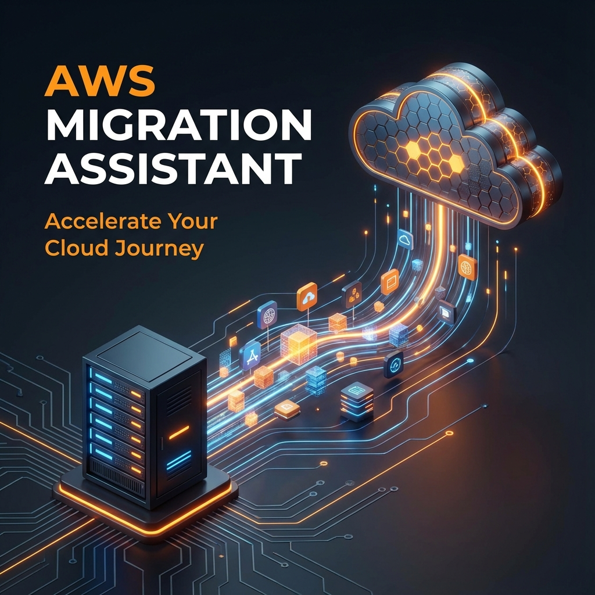
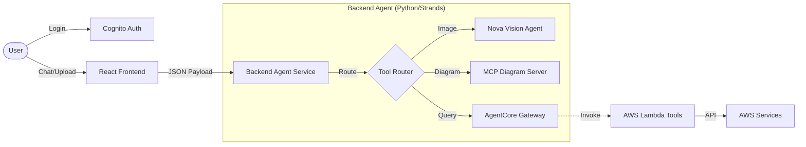

# ☁️ AWS Migration Assistant (AgentCore Gateway)

An intelligent, multi-modal AI agent designed to assist organizations in migrating on-premises workloads to AWS. Built with **Amazon Bedrock**, **Anthropic Claude 3.5 Sonnet**, and **AgentCore Gateway**.

## 🚀 Key Features

*   **Hybrid Agent Architecture**: Combines remote AWS Lambda tools (Gateway) with local tools (Vision/Diagrams).
*   **Multi-Modal Analysis**: Upload High-Level Design (HLD) or Low-Level Design (LLD) images for instant architectural auditing using **Amazon Nova Pro**.
*   **Dynamic Diagram Generation**: Generates professional AWS architecture diagrams on-the-fly using MCP (Model Context Protocol).
*   **Cost Estimation**: Real-time cost estimates for AWS services via authorized Lambda tools.
*   **IP Planning**: Specialized VPC Subnet Calculator for Private IPv4 conservation.
*   **Secure Authentication**: Full Cognito integration with persistent chat sessions.
*   **Premium UI**: Modern, responsive React frontend with glassmorphism design.

---

## 🏗️ System Architecture

The solution uses a **Hybrid Agentic Architecture**, bridging local interactive tools with scalable cloud serverless functions.

### 📐 User Flow


<details><summary>View Mermaid Code</summary>

![Architecture Diagram]

<details><summary>View Mermaid Code</summary>


<details><summary>View Mermaid Code</summary>


</details>
</details>
</details>

### ☁️ Infrastructure Diagram


<details><summary>View Mermaid Code</summary>

![Architecture Diagram](https://mermaid.ink/img/Zmxvd2NoYXJ0IFRCCiAgICBzdWJncmFwaCBDbGllbnQgWyLwn5K7IENsaWVudCBTaWRlIl0KICAgICAgICBVSVtSZWFjdCBVSSAoVml0ZSldCiAgICAgICAgU3RvcmVbTG9jYWwgU3RvcmFnZSBTZXNzaW9uXQogICAgZW5kCgogICAgc3ViZ3JhcGggQmFja2VuZCBbIuKame-4jyBBZ2VudCBTZXJ2aWNlIl0KICAgICAgICBBZ2VudFtNaWdyYXRpb24gQWdlbnQgKFB5dGhvbi9TdHJhbmRzKV0KICAgICAgICBNZW1vcnlbU2Vzc2lvbiBNZW1vcnkgKERpY3QvRHluYW1vREIpXQogICAgICAgIE1DUF9DbGllbnRbTUNQIENsaWVudF0KICAgIGVuZAoKICAgIHN1YmdyYXBoIEFXUyBbIuKYge-4jyBBV1MgQ2xvdWQiXQogICAgICAgIENvZ25pdG9bQ29nbml0byBVc2VyIFBvb2xdCiAgICAgICAgQmVkcm9ja1tBbWF6b24gQmVkcm9jayAoQ2xhdWRlIDMuNSBTcG5uZXQpXQogICAgICAgIExhbWJkYVtBV1MgTGFtYmRhIChHYXRld2F5IFRvb2xzKV0KICAgICAgICBUaXRhbltUaXRhbiBJbWFnZSBHZW5dCiAgICAgICAgTm92YVtOb3ZhIFBybyBWaXNpb25dCiAgICBlbmQKCiAgICBVSSAtLT58QXV0aHwgQ29nbml0bwogICAgVUkgPC0tPnxIVFRQL1JFU1R8IEFnZW50CiAgICBBZ2VudCA8LS0-fExMTSBJbmZlcmVuY2V8IEJlZHJvY2sKICAgIEFnZW50IDwtLT58RGlyZWN0IEludm9rZXwgTGFtYmRhCiAgICBBZ2VudCA8LS0-fEdlbmVyYXRlfCBNQ1BfQ2xpZW50CiAgICBNQ1BfQ2xpZW50IC0uLT4gVGl0YW4KICAgIEFnZW50IC0uLT58QW5hbHl6ZXwgTm92YQ==)

<details><summary>View Mermaid Code</summary>


<details><summary>View Mermaid Code</summary>

```mermaid
flowchart TB
    subgraph Client ["Client Side"]
        UI[React UI (Vite)]
        Store[Local Storage Session]
    end

    subgraph Backend ["Agent Service"]
        Agent[Migration Agent (Python/Strands)]
        Memory[Session Memory (Dict/DynamoDB)]
        MCP_Client[MCP Client]
    end

    subgraph AWS ["AWS Cloud"]
        Cognito[Cognito User Pool]
        Bedrock[Amazon Bedrock (Claude 3.5 Sonnet)]
        Lambda[AWS Lambda (Gateway Tools)]
        Titan[Titan Image Gen]
        Nova[Nova Pro Vision]
    end

    UI -->|Auth| Cognito
    UI <-->|HTTP/REST| Agent
    Agent <-->|LLM Inference| Bedrock
    Agent <-->|Direct Invoke| Lambda
    Agent <-->|Generate| MCP_Client
    MCP_Client -.-> Titan
    Agent -.->|Analyze| Nova
```
</details>
</details>
</details>

1.  **Frontend (`migration_agent_frontend`)**: 
    *   React + Vite SPA.
    *   AWS Amplify (Cognito) for Auth.
    *   Markdown & Image Rendering for rich chat experience.
2.  **Backend Agent (`migration_agent_gateway`)**:
    *   Python-based Agent using `strands` framework.
    *   **AgentCore Gateway**: Managed interface to backend Lambda tools.
    *   **Local Tools**: `arch_diag_assistant` (MCP) and `hld_lld_input_agent` (Nova Vision).
    *   **Memory**: Session-persistent memory using global store (POC).

---

## 🛠️ Prerequisites

*   **Python 3.10+**
*   **Node.js 18+**
*   **AWS CLI** configured with valid credentials (`~/.aws/credentials`).
*   **uv** (Fast Python package installer) - Required for MCP diagram tool.
    *   Install: `curl -LsSf https://astral.sh/uv/install.sh | sh`

---

## 📥 Installation

### 1. Backend Setup

```bash
cd migration_agent_gateway

# Create Virtual Environment
python3 -m venv .venv
source .venv/bin/activate  # Windows: .venv\Scripts\activate

# Install Dependencies
pip install -r requirements.txt
```

### 2. Frontend Setup

```bash
cd migration_agent_frontend

# Install Node Modules
npm install
```

---

## ▶️ Running the Application

You need two terminal windows running simultaneously.

### Terminal 1: Backend Agent Service

```bash
cd migration_agent_gateway
source ../.venv/bin/activate

# Ensure AWS Credentials are valid
# export AWS_PROFILE=default  (if needed)

# Start the Agent Server
python migration_agent.py
```
*   Server runs on: `http://localhost:8000`

### Terminal 2: Frontend UI

```bash
cd migration_agent_frontend

# Start Vite Dev Server
npm run dev
```
*   UI accessible at: `http://localhost:5173`

---

## 🧩 Usage Guide

1.  **Login**: Use the credentials provided (or Sign Up if enabled).
2.  **Chat**: Ask natural language questions.
    *   *"How do I migrate a 3-tier Java app to AWS?"*
    *   *"Estimate cost for 2 m5.large instances and an RDS db.m5.large."*
3.  **Vision Analysis**: Click the **Paperclip** icon to upload an architecture diagram.
    *   Ask: *"Analyze this diagram and suggest improvements."*
4.  **Diagram Generation**:
    *   Ask: *"Generate an architecture diagram for a Serverless API with caching."*
    *   Result: A professional PNG diagram will be rendered in the chat.
    *   **Download**: Click the "Download" button to save the diagram locally.

---

## 🔧 Troubleshooting

*   **"Security token included in the request is invalid"**:
    *   Your local AWS temporary credentials have expired.
    *   **Fix**: Refresh credentials in the backend terminal and restart `migration_agent.py`.
*   **Diagrams not generating**:
    *   Ensure `uv` is installed and in your PATH.
    *   Check backend logs for `uvx` errors.
*   **Chat History lost on restart**:
    *   The current POC uses in-memory storage for session history. It resets if the backend process stops. (Production would use DynamoDB).

---

## 📜 License

Project created for **IBM Innovathon 2025**.
Using AgentCore Gateway & strands framework.